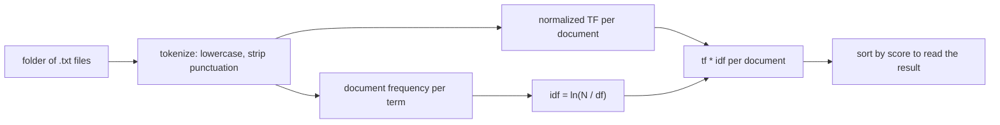

# What TF-IDF is doing

Term frequency–inverse document frequency is a way to score a word
inside one document **relative to a collection**. This repo uses the
version that showed up in a lot of 2010s NLP tutorials:

1. Count how often the word appears in the document.
2. Divide by the document's length so long books do not win automatically.
3. Down-weight words that appear in many documents.
4. Multiply.

That product is the number sitting in `output/tfidf/*.txt`.

## Term frequency alone is a poor fingerprint

In English running text, the most common tokens are almost always
`the`, `and`, `of`, `to`, `a`. If you rank *Moby-Dick* by raw counts,
you learn that Melville wrote English. You do not learn that the book
is about a whale.

Normalized TF (`count / |d|`) fixes length. It does not fix ubiquity.
`the` is still the mode.

## Inverse document frequency asks a different question

Document frequency `df(t)` is not "how often does `t` occur?" It is
"in how many documents does `t` occur at least once?"

- `the` appears in all 18 Gutenberg files in this repo, so `df(the) = 18`.
- `pequod` is concentrated in *Moby-Dick*, so `df(pequod)` is small.
- `alice` appears in three files here (Carroll, plus passing mentions
  elsewhere), so it is rare but not unique.

IDF turns that into a weight. With no smoothing:

```
idf(t) = ln(N / df(t))
```

| Situation | df | idf |
| --- | --- | --- |
| The word is in every document | N | ln(1) = 0 |
| The word is in half the documents | N/2 | ln(2) ≈ 0.693 |
| The word is in exactly one document | 1 | ln(N) |

On the Gutenberg collection, `ln(18) ≈ 2.890`. That is the ceiling you
see in `output/idf.txt` for one-off tokens (including a lot of noise:
page numbers, OCR leftovers, unique typos).

## The product is a compromise

```
tfidf(t, d) = tf(t, d) * idf(t)
```

A good term has to be **common in this document** and **uncommon in
the collection**. That is why:

- `emma` beats `the` in *Emma*.
- `whale` beats `the` in *Moby-Dick*.
- `unto` beats many proper names in the King James Bible: inside that
  file it is frequent, and the novels barely use it.
- `macb` beats `macbeth` in the Macbeth file: the speaker tag is
  repeated constantly, and the other plays use different tags.

TF-IDF is not a parser. It will happily promote a speaker abbreviation,
a license word, or a digit string if those tokens satisfy the two
conditions above.

## What this formulation is not

People write "TF-IDF" for a family of related formulas. Variants you
will see elsewhere, and that this toy does **not** use:

- raw TF instead of length-normalized TF
- log TF (`1 + ln(count)`) so a word that appears 400 times does not
  dwarf one that appears 40 times
- add-one or smoothed IDF, `ln(N / (df + 1)) + 1`, so no weight is
  exactly zero
- cosine-normalized document vectors, which matter once you compare
  documents to each other rather than ranking terms inside one document
- sublinear scaling, BM25, or language-model weighting

The Perl scripts here are the plain product of normalized TF and
`ln(N / df)`. The Python toy in `examples/tfidf_toy.py` copies that
product on purpose, so a hand calculation and a program listing can be
checked against each other.

## A picture of the pipeline



The original scripts stop at the TSV files (the `prod` step). They
never sort by score. `scripts/rank_precomputed_tfidf.py` and
`examples/tfidf_toy.py` add that last box.
